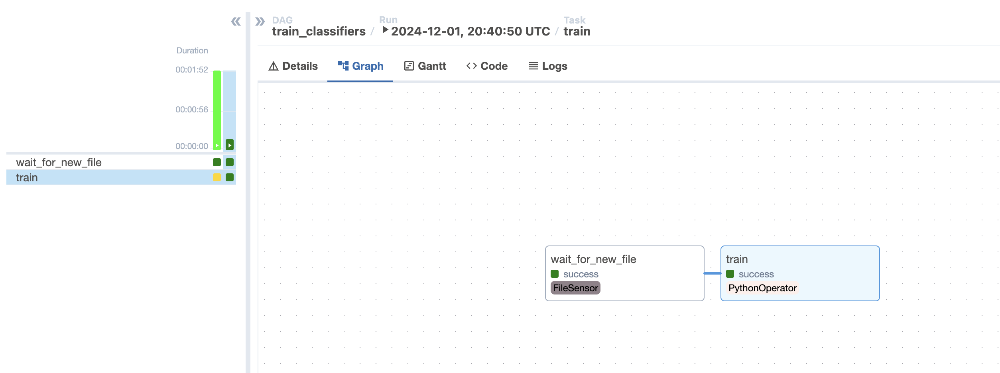
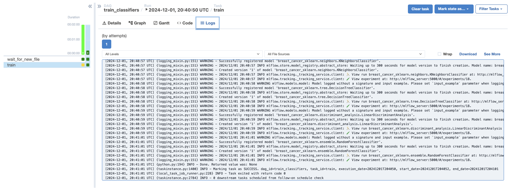
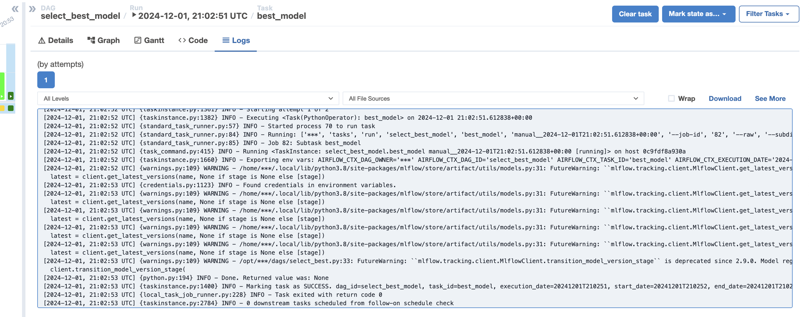

# Пайплайн для обучения классификаторов
Для обучения были выбраны следующие классификаторы:
- Логистическая регрессия
- Метод k ближайших соседей
- Дерево решений
- Линейный дискриминантный анализ
- Случайный лес

Датасет sklearn - breast_cancer

# Пайплайн для хостинга лучшей модейли

