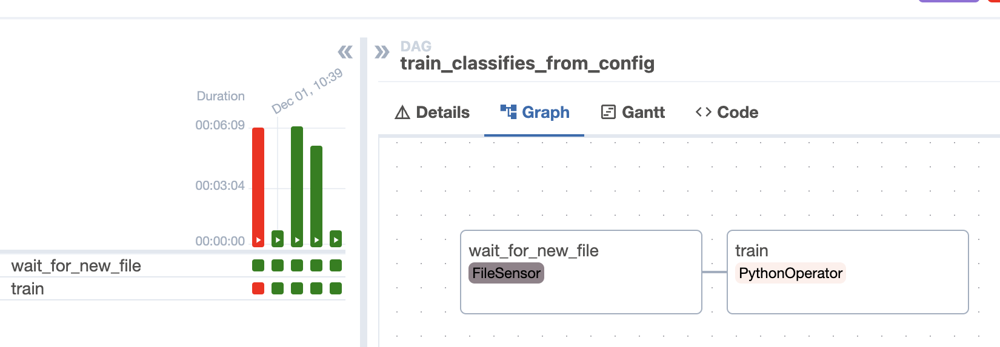
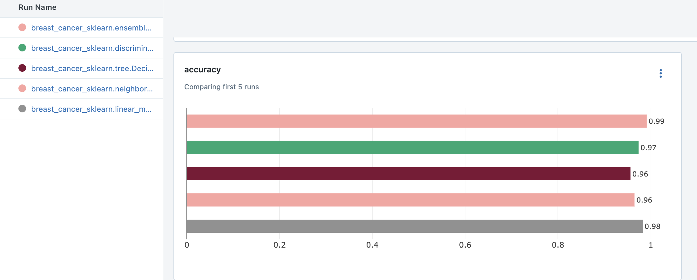
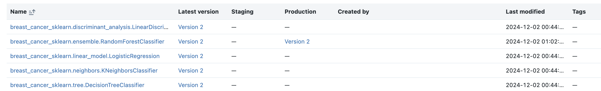
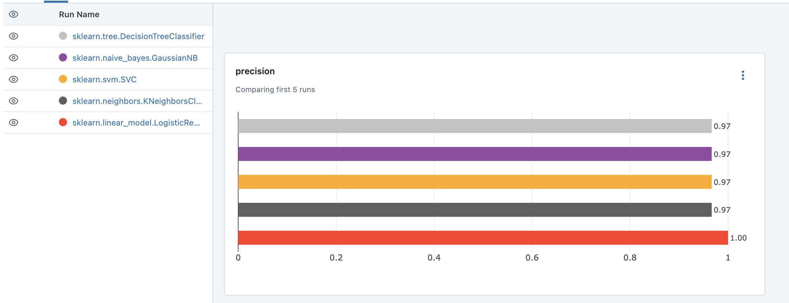
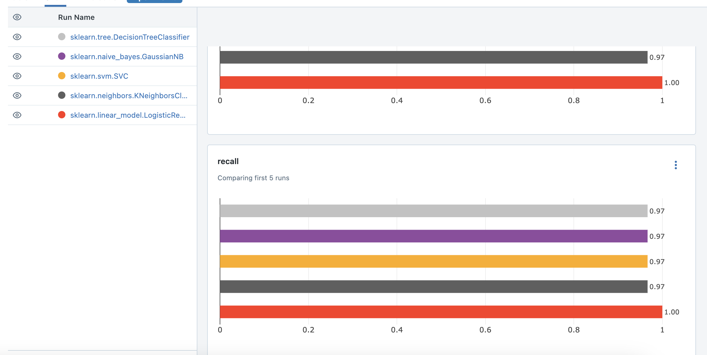
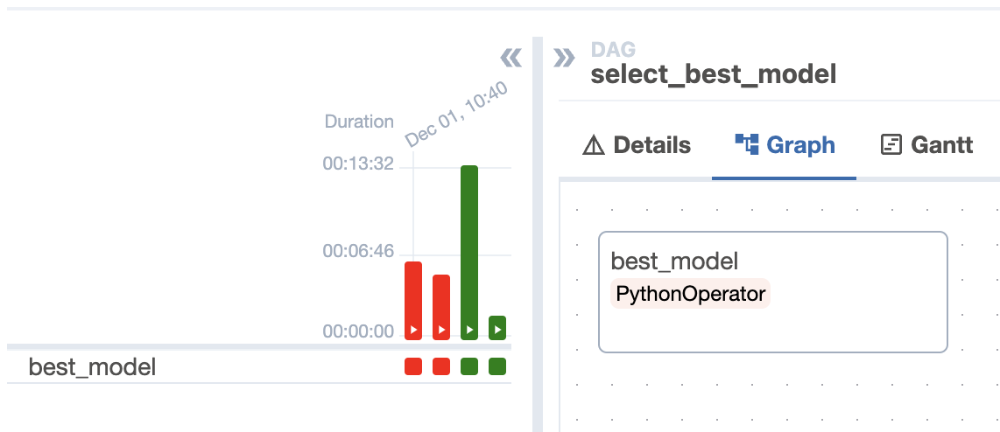
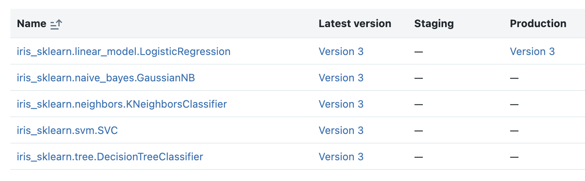

# Пайплайн для обучения классификаторов
Для обучения были выбраны следующие классификаторы:
- Логистическая регрессия
- Наивный байесовский классификатор
- Метод k ближайших соседей
- Метод опорных векторов
- Дерево решений

Были использованы параметры по умолчанию в sklearn, см. в файле config.yaml

В качестве данных - датасет ирисы из sklearn

# Пайплайн для хостинга лучшей модейли

Для работоспособности mlflow необходимо было добавить зависимость boto3