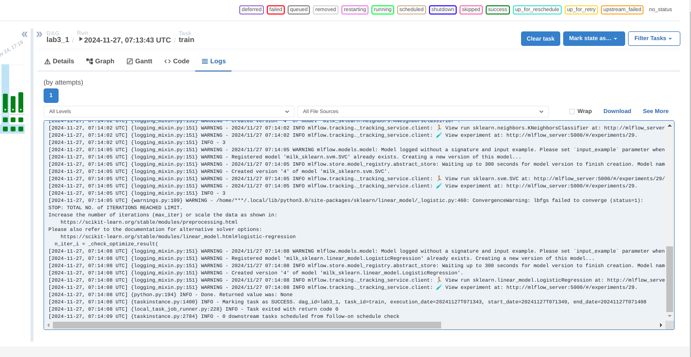
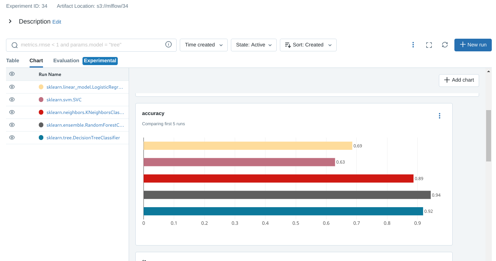
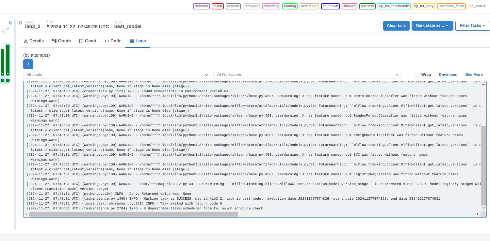
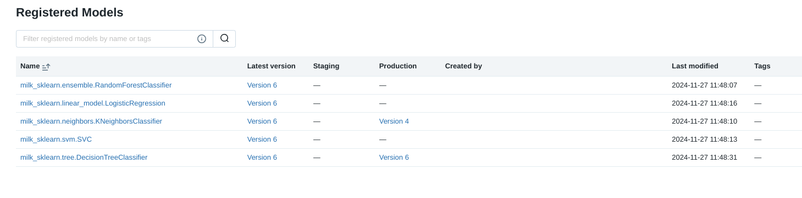

# lab3 / Мисюрина И. / 6233-010402D

### train  
Датасет [milknew.csv](milknew.csv), определяем качество молока по
pH, жирности, цвету и др. параметрам.

DAG's tasks [lab3_1.py](lab3_1.py):
- 1 / wait_for_new_file / FileSensor ожидает поступления файла 
  (аналогично предыдущей работе)
- 2 / train / Скрипт считывает датасет и делает разбиение на 
  train/test/val выборки, валидационная сохраняется (для оценки на этапе деплоя).
  Модели заданы ямлом [config.yaml](config.yaml), в цикле 
  каждая модель формируется по конфигу, обучается, оценивается и 
  сохраняется.

Скрин с выполненными таксами:  
  
Модельки зарегистрированные в млфлоу:  
  

### deploy   

DAG's tasks [lab3_2.py](lab3_2.py):
- 1 / validate / подгружаются сохраненный валидационный
  набор и обученные модели, модели оцениваются по f1.
  лучшая модель "переводится в прод" - устанавливается stage='Production'.

Скрин с выполненными таксами:  
  
"Выкатка" лучшей модели:  
  

Из интересного - при первом запуске контейнеров обнаружилось,
что веб у млфлоу нерабочий, по логам - нет коннекта к бд.
Для коннекта mlflow_server очень
хотел питон-библиотеку cryptography (по всей видимости 
это из-за бампа версии бдшки и обновления протоколов,
см. историю с утеканием контейнера на линуксе
из 1 лабы), и, как ни странно,
после ручного докидывания библиотеки в контейнер деплой поднялся, 
проблем с доступом к бд более не возникало.