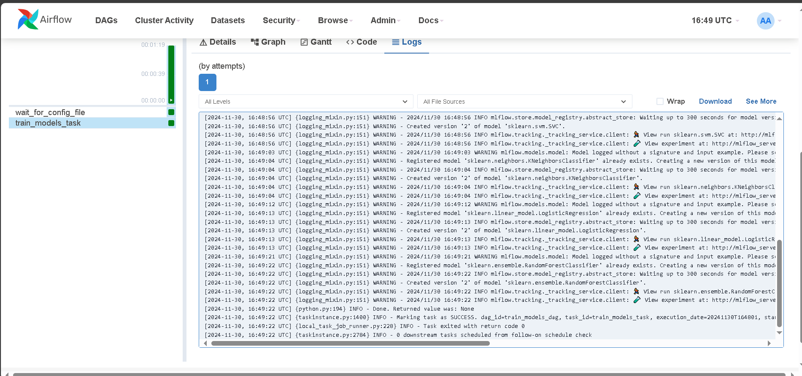
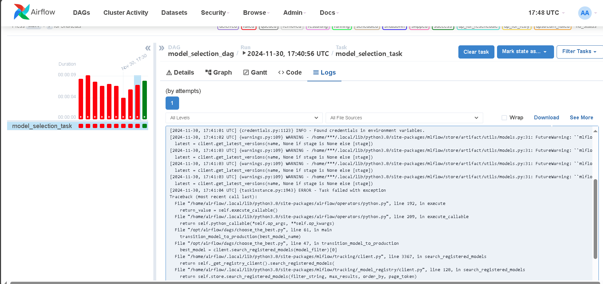
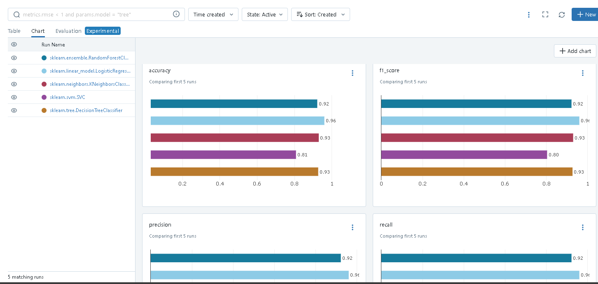
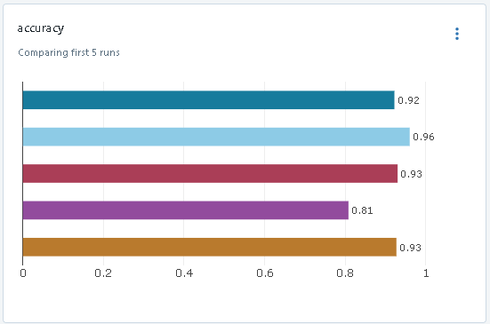
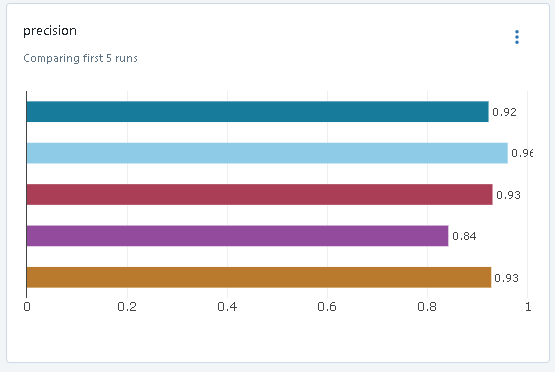
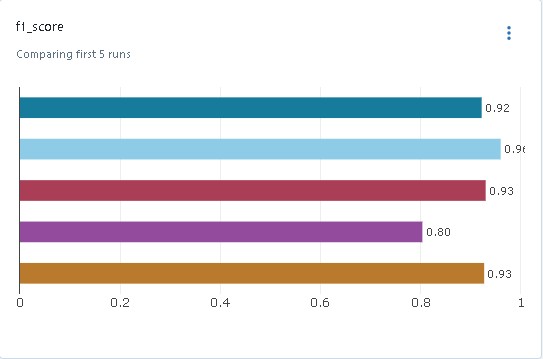
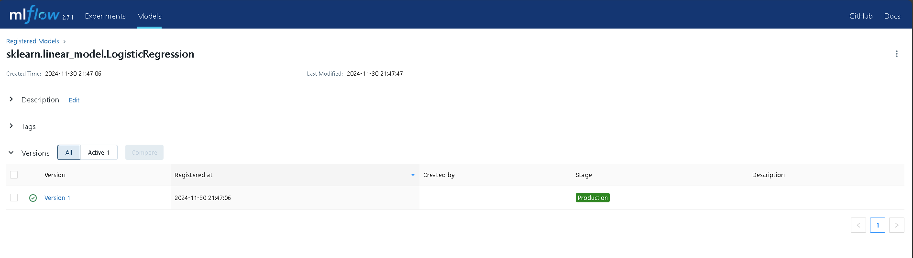

##Первый пайплайн

1 - wait_for_config_file - FileSensor ожидает поступления файла config.yaml
Сначала хотел использовать json, однако код почему то не хотел работать, что бы я ни использовал. Тогда я решил, что проще перейти на yaml
2 - train_models_task - тренируем 5 моделей, параметры которых есть в config.yaml
Использовал датасет под который подошли все 5 моделей citrus.csv, файл приложен (но сначала пытался использовать датасет, который был для 1 лабы - не преуспел)

##Второй пайплайн

1 - model_selection_task - выбирается лучшая модель на датасете citrus.csv - логистическая регрессия, и переводится в stage Production в mlflow

Пробовал запускать wait_for_config_file и train_models_task много раз, но в какой-то момент обновил названия переменных, потому что путаться сам начал и оно сработало с 1 раза

То же самое касается model_selection_task - пробовал запускать много раз, не получалось написать загрузку моделей, код не работал без None, потом разобрался с логами, поправил, все хорошо стало

После отработки получились вот такие результаты

##Графики

И финальный выбор лучшей модели

