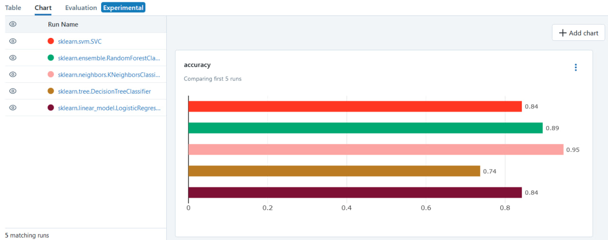
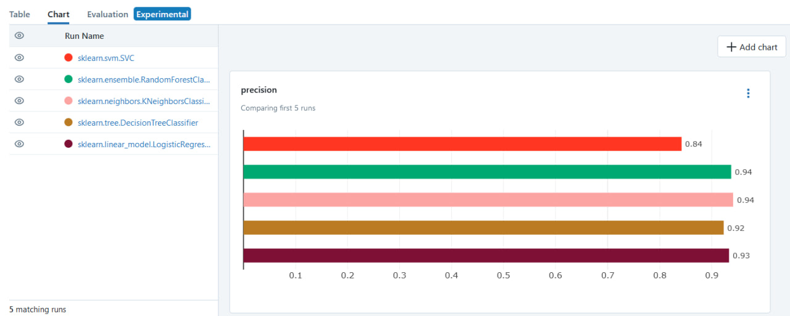
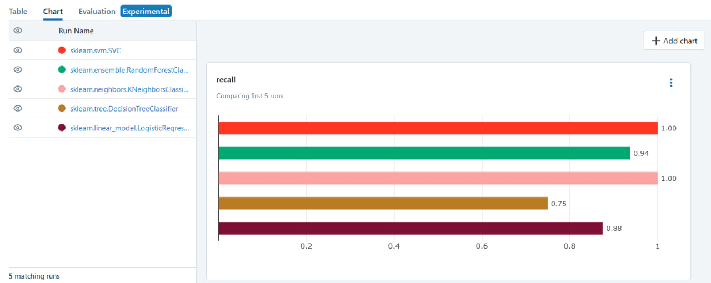
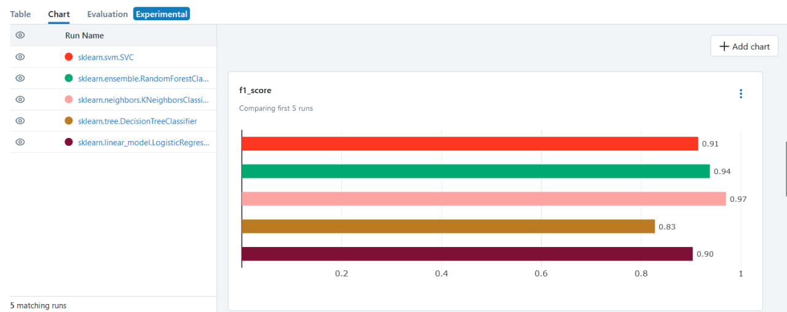
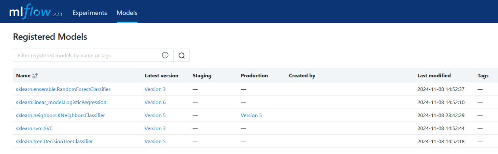

# Лабораторная работа 3
# Читоркин Егор, группа 6233-010402D

## Пайплайн для обучения классификаторов

В ходе выполнения данной части задания был реализован пайплайн, выполняющий обучения классификаторов на основании конфигураций из yaml-файла, и сохраняющий информацию в mlflow. DAG состоит из двух этапов:

1. Ожидание файлов
```py
wait_for_new_file = FileSensor(
    task_id='wait_for_new_file',
    poke_interval=10,
    filepath=path_to_input,
    fs_conn_id='lab_connect',
    dag=dag,
)
``` 
Здесь все реализовано как в предыдущей работе, так что добавить нечего :)

2. Непосредственно обучение
Я работал через ```PythonOperator```, поэтому рассмотрим соответствующую функцию.

- Сначала считывается датасет для обучения (датасет ```parkinsons```)
- Далее формируются обучающая, тестовая и валидационная выборки
- Далее происходит конфигурация ```mlflow``` для проведения эксперимента
- Далее на основании данных из yaml-файла создается классификатор с заданными параметрами и происходит обучение, а также логирование результатов обучения:
```py
mlflow.start_run(run_name=conf['classificator'], experiment_id=experiment)

module = importlib.import_module('.'.join(conf['classificator'].split('.')[:-1]))
classificator_class = getattr(module, conf['classificator'].split('.')[-1])
model = classificator_class(**conf['kwargs'])

model.fit(x_train, y_train)

y_pred = model.predict(x_test)

mlflow.log_metrics({
    "f1_score": f1_score(y_test, y_pred),
    "accuracy": accuracy_score(y_test, y_pred),
    "precision": precision_score(y_test, y_pred),
    "recall": recall_score(y_test, y_pred)
})

model_info = mlflow.sklearn.log_model(sk_model=model, artifact_path=conf['classificator'])
model_uri = model_info.model_uri
registered_model = mlflow.register_model(model_uri=model_uri, name=conf['classificator'])

mlflow.end_run()
```

(запускался много раз, чтобы проверять работоспособность каждого шага)


Получились вот такие диаграммки






## Пайплайн для хостинга лучшей модели

В ходе выполнения данной части задания был реализован пайплайн, выполняющий валидацию обученных моделей и перевод лучшей из них в ```Production```. Здесь тоже использовался ```PythonOperator```, поэтому рассмотрим соответствующую ему функцию:

- Сначала подгружается валидационная выборка
- Далее мы подгружаем модели из ```model_registry``` и проводим валидацию, сохраняем f1-меру
```py
for _, conf in enumerate(config['configs']):
    model = mlflow.sklearn.load_model(f"models:/{conf['classificator']}/None")
    y_pred = model.predict(x_val)
    f1_scores[conf['classificator']] = f1_score(y_val, y_pred)
```

- Далее выбирается модель с лучшим значение ```f1-меры``` и переводится в stage ```Production```:
```py
client = mlflow.MlflowClient()

filter_string = f"name='{best_model_name}'"
best_model = client.search_registered_models(filter_string)[0]
all_versions = client.search_model_versions(filter_string=filter_string)
client.transition_model_version_stage(
        name=best_model.name,
        version=all_versions[0].version,
        stage='Production'
    )
```

