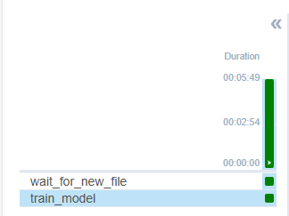
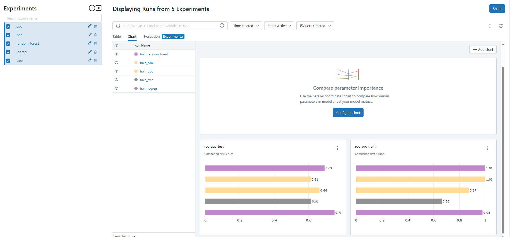
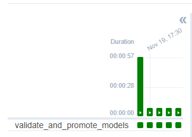
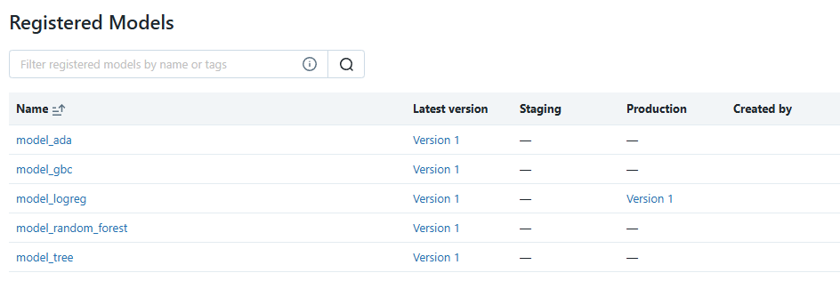

# Airflow и MLflow - логгирование экспериментов и версионирование моделей
### Работу выполнила Вахлаева Марина 6231-010402D
## Пайплайн для инференса данных

В рамках данной лабораторной работы предлагается построить два пайплайна:

- Пайплайн, который обучает любой классификатор из sklearn по заданному набору параметров.
- Пайплайн, который выбирает лучшую модель из обученных и производит её хостинг.
Для построения такого пайплайна воспользуемся следующими инструментами: Apache Airflow, MLflow

#### Перечень сервисов с их адресами

* pgAdmin: <http://localhost:18081/>  (`pgadmin4@pgadmin.org`@`admin`)
* Kibana: <http://localhost:15601/>
* Apache Airflow: <http://localhost:8080/> (`airflow`@`airflow`)
* Apache Nifi: <http://localhost:18080/>
* MLflow: <http://localhost:5001>
* Minio: <http://localhost:9000> (`minio`@`minio123`)

## Задание 
### Пайплайн для обучения классификаторов

Построенный пайплайн будет выполнять следующие действия поочередно:

1. Производить мониторинг целевой папки на предмет появления новых конфигурационных файлов классификаторов (в форматах `.json` или `.yaml`).
2. Обучать классификатор в соответствии с полученными параметрами. 
   - Производить логгирование параметров модели в **MLflow**. 
   - Производить логгирование процесса обучения **MLflow**. 
   - Производить тестирование модели и сохранять его результаты в **MLflow**.
3. Сохранять обученный классификатор в `model registry` **MLflow**.

### Пайплайн для хостинга лучшей модейли

Построенный пайплайн будет выполнять следующие действия поочередно:

1. В соответствии с таймером производит валидацию новых моделей из `model registry`.
2. Модель с лучшим показателем метрики переводится на `stage: Production`
3. (Опционально) произвести хостинг лучшей модели

## Выполнение
### Пайплайн для обучения классификаторов

Все модели для классификации и их гиперпараметры прописаны в .yaml файлах в папке config.
Использовались следующие модели: `AdaBoost`, `GradientBoosting`, `LogisticRegression`, `RandomForest`, `DecisionTree`. 

Мониторинг целевой папки осуществлялся с помощью FileSensor'a из предыдущей лабораторной работы. Настройки данного коннектора 
можно посмотреть [тут](https://github.com/vmokook/Lab-2-2024/blob/main/solution/LR2.md) 

   - Вспомогательная функция `get_models_and_data_from_yaml` предназначена для извлечения моделей из .yaml
   - Функция `setup_experiment` выполняет настройку эксперимента в MLflow, удаляет предыдущие запуски при их наличии.
   - `train_model_function` - основная функция, которая выполняет обучение классификаторов с гиперпараметрам, полученными из .yaml файлов.
Для каждой модели из списка настраивается эксперимент с помощью `setup_experiment`. Данные для обучения были взяты с хакатона AlfaHack, кейс по кредитному скорингу юр. лиц.
Данные обезличены. Далее запускается эксперимент, результат обучения логируется. Результат записывается в MLFlow.

Результаты выполнения: 

### Пайплайн для хостинга лучшей модейли

   - `get_all_model_versions` данная функция получает информацию о версиях всех зарегистрированных моделей в MLflow Registry.
Запрос осуществляется через client.search_registered_models.
   - `find_best_model` - осуществляет поиск наилучшей модели на основе показателя метрики (roc_auc_test) среди всех версий.
Возвращает информацию о лучшей модели и значении её метрики.
   - `promote_best_model` - осуществляет продвижение лучшей модели на стадию Production, при этом архивируются предыдущие Production-версии.

Результаты выполнения: 

