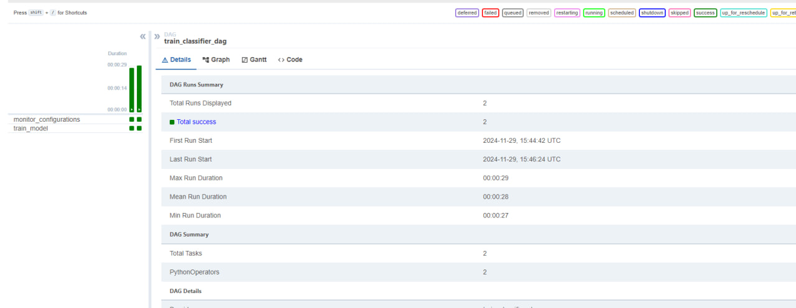
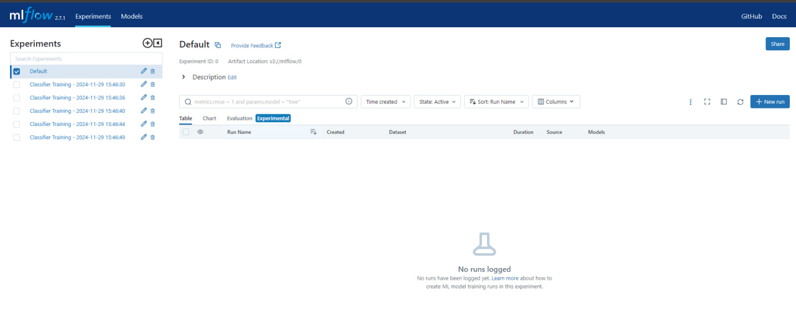
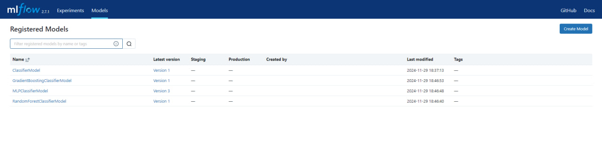
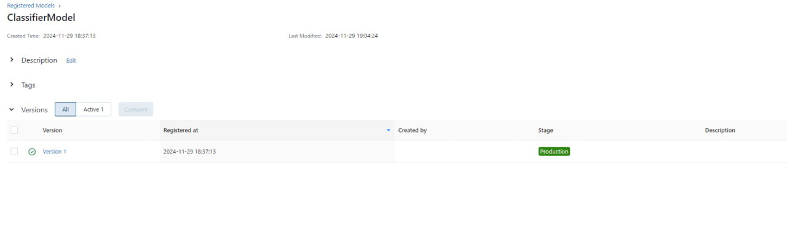

# Кришталь Кирилл Евгеньевич Группа 6231-010402D
# Лабораторная работа №3: Airflow и MLflow — логгирование экспериментов и версионирование моделей  

## Часть 1: Пайплайн для обучения классификаторов  

### Описание  
На первом этапе создаются две функции:  
1. **Мониторинг целевой папки:**  
   - Проверка папки на наличие новых конфигурационных файлов для классификаторов в форматах `.json` или `.yaml`.  

2. **Извлечение параметров и обучение классификатора:**  
   - Чтение конфигурационного файла для извлечения параметров.  
   - Обучение классификатора с использованием этих параметров.  
   - Сохранение обученной модели в **MLflow**.  

**Примечание:** для обучения используется готовый датасет **Iris** из библиотеки `scikit-learn`.  

### Реализация DAG  
На основе двух функций создан DAG, который автоматизирует процесс обучения и логгирования классификаторов. DAG запускается через **Airflow**.  

**Пример работы DAG:**  
  

### Проверка экспериментов в MLflow  
После успешного запуска пайплайна результаты экспериментов сохраняются в MLflow.  

**Эксперименты в MLflow:**  
  

### Сохранённые классификаторы  
В MLflow записываются все версии обученных классификаторов.  

**Классификаторы в MLflow:**  
  

### Файлы конфигурации  
Все конфигурационные файлы для классификаторов доступны в папке `config`.  

---

## Часть 2: Пайплайн для хостинга лучшей модели  

### Описание  
На втором этапе создаётся пайплайн для:  
1. **Валидации новых моделей:**  
   - Проверка производительности моделей, сохранённых в MLflow.  

2. **Перевода лучшей модели в Production:**  
   - Лучшая модель автоматически определяется по метрикам.  
   - Модель переводится на стадию **Production**.  

### Реализация DAG  
DAG, реализующий этот процесс, добавлен в папку `dags` и запускается через **Airflow**.  

**Production в MLflow:**  
  

### Результаты  
На скриншоте видно, что лучшая модель успешно:  
- Выявлена по метрикам.  
- Переведена на стадию **Production** с указанием лучшей версии.  

